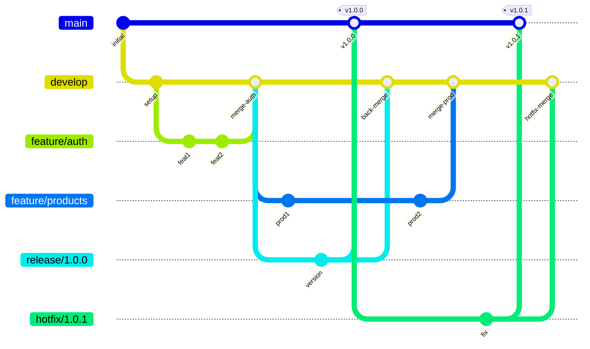

# LankaCommerce Cloud - Branching Strategy

## Overview

LankaCommerce Cloud follows a **GitFlow-based branching strategy** adapted for
continuous deployment. This document defines branch types, naming conventions,
and workflows for all team members.

## Quick Reference

| Branch Type | Pattern     | Base    | Merge To      | Purpose         |
| ----------- | ----------- | ------- | ------------- | --------------- |
| main        | `main`      | -       | -             | Production code |
| develop     | `develop`   | main    | main          | Integration     |
| feature     | `feature/*` | develop | develop       | New features    |
| bugfix      | `bugfix/*`  | develop | develop       | Bug fixes       |
| hotfix      | `hotfix/*`  | main    | main, develop | Critical fixes  |
| release     | `release/*` | develop | main, develop | Release prep    |

---

## Main Branch (`main`)

### Purpose

The `main` branch represents **production-ready code**. Every commit on main
should be deployable to production.

### Rules

1. **Protected branch** - Direct commits not allowed
2. **Pull requests required** - All changes via PR
3. **Reviews required** - Minimum 2 approvals
4. **CI must pass** - All checks green before merge
5. **No force push** - History must be preserved

### Merge Sources

| Source Branch | When                      |
| ------------- | ------------------------- |
| release/\*    | Completing a release      |
| hotfix/\*     | Critical production fixes |

### Protection Settings

| Setting                     | Value                 |
| --------------------------- | --------------------- |
| Require pull request        | Yes                   |
| Required approvals          | 2                     |
| Dismiss stale reviews       | Yes                   |
| Require status checks       | Yes                   |
| Require branches up-to-date | Yes                   |
| Include administrators      | Yes                   |
| Restrict who can push       | Release managers only |
| Allow force pushes          | No                    |
| Allow deletions             | No                    |

### Versioning

Main branch reflects production versions:

- Tagged with semantic version: `v1.0.0`, `v1.1.0`
- Each merge from release creates a tag

---

## Develop Branch (`develop`)

### Purpose

The `develop` branch is the **integration branch** for features. It contains
the latest development changes for the next release.

### Rules

1. **Protected branch** - Direct commits limited
2. **Pull requests preferred** - Features via PR
3. **Reviews required** - Minimum 1 approval
4. **CI must pass** - All checks green before merge
5. **No force push** - History preserved

### Merge Sources

| Source Branch | When                  |
| ------------- | --------------------- |
| feature/\*    | Feature complete      |
| bugfix/\*     | Bug fixed             |
| hotfix/\*     | After merging to main |

### Merge Targets

| Target Branch | When               |
| ------------- | ------------------ |
| release/\*    | Starting a release |

### Protection Settings

| Setting                     | Value                    |
| --------------------------- | ------------------------ |
| Require pull request        | Yes                      |
| Required approvals          | 1                        |
| Dismiss stale reviews       | Yes                      |
| Require status checks       | Yes                      |
| Require branches up-to-date | No (allow parallel work) |
| Include administrators      | No                       |
| Restrict who can push       | No                       |
| Allow force pushes          | No                       |
| Allow deletions             | No                       |

### Integration Rules

- Merge features using **squash merge** for clean history
- Resolve conflicts in feature branch before merging
- Delete feature branch after successful merge
- Run integration tests after major feature merges

---

## Feature Branches (`feature/*`)

### Purpose

Feature branches are used to develop **new functionality**. Each feature
should have its own branch.

### Naming Convention

```
feature/<ticket>-<short-description>
```

**Components:**

- `feature/` - Branch prefix
- `<ticket>` - Issue tracker ID (e.g., LCC-123)
- `<short-description>` - Kebab-case description (2-4 words)

### Examples

```
feature/LCC-123-user-authentication
feature/LCC-456-product-search
feature/LCC-789-checkout-flow
feature/LCC-101-dashboard-widgets
```

### Workflow

1. **Create branch from develop**

   ```bash
   git checkout develop
   git pull origin develop
   git checkout -b feature/LCC-123-user-authentication
   ```

2. **Develop feature**
   - Make commits following commit conventions
   - Push regularly to remote
   - Keep branch up-to-date with develop

3. **Update from develop**

   ```bash
   git checkout develop
   git pull origin develop
   git checkout feature/LCC-123-user-authentication
   git rebase develop
   ```

4. **Create pull request**
   - Target: develop
   - Request review
   - Wait for CI to pass

5. **Merge and cleanup**
   - Squash merge to develop
   - Delete feature branch

   ```bash
   git branch -d feature/LCC-123-user-authentication
   git push origin --delete feature/LCC-123-user-authentication
   ```

### Rules

- One feature per branch
- Keep branches short-lived (< 2 weeks)
- Sync with develop daily
- Delete after merge

### Branch Lifetime

| Metric        | Target                 |
| ------------- | ---------------------- |
| Maximum age   | 2 weeks                |
| Commits       | 5-20                   |
| Files changed | Focus on feature scope |

---

## Bugfix Branches (`bugfix/*`)

### Purpose

Bugfix branches are used to fix **non-critical bugs** in the development
cycle. These are bugs found during development, not in production.

### Naming Convention

```
bugfix/<ticket>-<short-description>
```

**Components:**

- `bugfix/` - Branch prefix
- `<ticket>` - Issue tracker ID (e.g., LCC-456)
- `<short-description>` - Kebab-case description

### Examples

```
bugfix/LCC-456-fix-login-validation
bugfix/LCC-789-correct-price-calculation
bugfix/LCC-012-resolve-null-pointer
bugfix/LCC-345-fix-date-formatting
```

### Workflow

1. **Create branch from develop**

   ```bash
   git checkout develop
   git pull origin develop
   git checkout -b bugfix/LCC-456-fix-login-validation
   ```

2. **Fix the bug**
   - Write tests first (TDD approach)
   - Implement fix
   - Verify fix

3. **Create pull request**
   - Target: develop
   - Reference issue
   - Request review

4. **Merge and cleanup**
   - Squash merge to develop
   - Delete bugfix branch

### When to Use

| Scenario                 | Use Bugfix?     |
| ------------------------ | --------------- |
| Bug in current sprint    | Yes             |
| Bug in develop           | Yes             |
| Bug found in code review | Yes             |
| Bug in production        | No (use hotfix) |
| Critical security issue  | No (use hotfix) |

### Bugfix vs Feature

| Aspect   | Feature           | Bugfix        |
| -------- | ----------------- | ------------- |
| Purpose  | New functionality | Fix existing  |
| Scope    | Can be large      | Usually small |
| Testing  | New tests         | Fix/add tests |
| Priority | Normal            | Higher        |

---

## Hotfix Branches (`hotfix/*`)

### Purpose

Hotfix branches are used for **critical production fixes** that cannot wait
for the next release. They are created from main and merged back to both
main and develop.

### Naming Convention

```
hotfix/<version>-<short-description>
```

**Components:**

- `hotfix/` - Branch prefix
- `<version>` - Patch version (e.g., 1.0.1)
- `<short-description>` - Brief description

### Examples

```
hotfix/1.0.1-critical-security-fix
hotfix/1.2.3-payment-gateway-error
hotfix/2.0.1-database-connection-fix
hotfix/1.5.2-memory-leak-fix
```

### Workflow

1. **Create branch from main**

   ```bash
   git checkout main
   git pull origin main
   git checkout -b hotfix/1.0.1-critical-security-fix
   ```

2. **Implement fix**
   - Minimal changes only
   - Add regression test
   - Document the fix

3. **Test thoroughly**
   - Run full test suite
   - Test in staging environment

4. **Merge to main**

   ```bash
   # Create PR to main
   # Get expedited review (minimum 1 approval)
   # Merge to main
   ```

5. **Tag the release**

   ```bash
   git checkout main
   git tag -a v1.0.1 -m "Hotfix: Critical security fix"
   git push origin v1.0.1
   ```

6. **Merge back to develop**

   ```bash
   git checkout develop
   git merge hotfix/1.0.1-critical-security-fix
   git push origin develop
   ```

7. **Cleanup**

   ```bash
   git branch -d hotfix/1.0.1-critical-security-fix
   git push origin --delete hotfix/1.0.1-critical-security-fix
   ```

### Hotfix Criteria

| Criteria               | Required |
| ---------------------- | -------- |
| Production affecting   | Yes      |
| Security vulnerability | Yes      |
| Data loss risk         | Yes      |
| Revenue impact         | Yes      |
| Can wait 1 week?       | No       |

### Expedited Review Process

| Step            | Time Limit |
| --------------- | ---------- |
| Code review     | 2 hours    |
| QA verification | 4 hours    |
| Approval        | Same day   |
| Deployment      | ASAP       |

### Hotfix vs Bugfix

| Aspect  | Hotfix         | Bugfix  |
| ------- | -------------- | ------- |
| Source  | main           | develop |
| Target  | main + develop | develop |
| Urgency | Critical       | Normal  |
| Review  | Expedited      | Normal  |
| Tag     | Yes            | No      |

---

## Release Branches (`release/*`)

### Purpose

Release branches are used to **prepare for a production release**. They
allow for last-minute bug fixes, documentation updates, and final testing
while development continues on develop.

### Naming Convention

```
release/<version>
```

**Components:**

- `release/` - Branch prefix
- `<version>` - Semantic version (e.g., 1.0.0)

### Examples

```
release/1.0.0
release/1.1.0
release/2.0.0
release/1.5.0-beta
```

### Workflow

1. **Create branch from develop**

   ```bash
   git checkout develop
   git pull origin develop
   git checkout -b release/1.0.0
   ```

2. **Prepare release**
   - Update version numbers
   - Update CHANGELOG.md
   - Final bug fixes only
   - Update documentation

3. **Version Updates**
   - backend: `__version__ = "1.0.0"`
   - frontend: `package.json` version
   - Documentation versions

4. **Final testing**
   - Run full test suite
   - Deploy to staging
   - QA verification
   - Performance testing

5. **Merge to main**

   ```bash
   # Create PR to main
   # Get 2 approvals
   # Merge to main
   ```

6. **Tag the release**

   ```bash
   git checkout main
   git tag -a v1.0.0 -m "Release 1.0.0: Initial release"
   git push origin v1.0.0
   ```

7. **Merge back to develop**

   ```bash
   git checkout develop
   git merge release/1.0.0
   git push origin develop
   ```

8. **Cleanup**

   ```bash
   git branch -d release/1.0.0
   git push origin --delete release/1.0.0
   ```

### Allowed Changes

| Activity                 | Allowed |
| ------------------------ | ------- |
| Bug fixes                | Yes     |
| Documentation            | Yes     |
| Version numbers          | Yes     |
| New features             | No      |
| Refactoring              | No      |
| Performance improvements | Limited |

### Release Branch Duration

| Phase       | Duration     |
| ----------- | ------------ |
| Preparation | 1-2 days     |
| Testing     | 2-3 days     |
| QA sign-off | 1 day        |
| Total       | 4-6 days max |

### Release Checklist

| Item                    | Status   |
| ----------------------- | -------- |
| Version numbers updated | Required |
| CHANGELOG.md updated    | Required |
| Tests pass              | Required |
| Documentation updated   | Required |
| QA approved             | Required |
| Security scan passed    | Required |

---

## Branch Lifecycle

### General Lifecycle

All branches follow this lifecycle:

```
Creation → Development → Review → Merge → Deletion
```

### Lifecycle Phases

#### 1. Creation

- Branch from appropriate base (develop/main)
- Follow naming convention
- Push to remote immediately
- Link to issue/ticket

#### 2. Development

- Make focused commits
- Follow commit conventions
- Sync with base regularly
- Push changes daily

#### 3. Review

- Create pull request
- Request reviewers
- Address feedback
- Pass CI checks

#### 4. Merge

- Ensure up-to-date with base
- Use appropriate merge strategy
- Verify CI passes
- Complete the merge

#### 5. Deletion

- Delete local branch
- Delete remote branch
- Verify deletion

### Lifecycle by Branch Type

| Type    | Created From | Merged To     | Lifetime  | Delete After |
| ------- | ------------ | ------------- | --------- | ------------ |
| feature | develop      | develop       | < 2 weeks | Merge        |
| bugfix  | develop      | develop       | < 1 week  | Merge        |
| hotfix  | main         | main, develop | < 1 day   | Merge        |
| release | develop      | main, develop | < 1 week  | Merge        |

### Branch Age Limits

| Branch Type | Warning   | Action Required    |
| ----------- | --------- | ------------------ |
| feature     | > 1 week  | Sync with develop  |
| feature     | > 2 weeks | Split or close     |
| bugfix      | > 3 days  | Escalate           |
| bugfix      | > 1 week  | Close or hotfix    |
| release     | > 3 days  | Complete or abort  |
| hotfix      | > 4 hours | Deploy or rollback |

### Stale Branch Policy

Branches that exceed age limits:

1. Review reason for delay
2. Sync with base branch
3. Split if too large
4. Close if abandoned
5. Delete stale remote branches monthly

### Branch Hygiene

| Activity               | Frequency   |
| ---------------------- | ----------- |
| Delete merged branches | Immediately |
| Review open branches   | Weekly      |
| Clean stale branches   | Monthly     |
| Audit branch naming    | Quarterly   |

---

## Merge Strategies

### Available Strategies

| Strategy      | Command    | When to Use        |
| ------------- | ---------- | ------------------ |
| Squash Merge  | `--squash` | Features, bugfixes |
| Regular Merge | `--no-ff`  | Releases, hotfixes |
| Rebase        | `rebase`   | Syncing with base  |

### Squash Merge

**Use for:** Feature branches, bugfix branches

Combines all commits into a single commit, creating a clean history.

```bash
# Via GitHub PR: "Squash and merge"

# Or via command line
git checkout develop
git merge --squash feature/LCC-123-feature
git commit -m "feat(module): add feature description (#123)"
```

**Benefits:**

- Clean, linear history
- One commit per feature
- Easy to revert
- Cleaner git log

**Commit Message:**
Use PR title as commit message.

### Regular Merge (No Fast-Forward)

**Use for:** Release branches, hotfix branches

Preserves branch history with a merge commit.

```bash
# Via GitHub PR: "Create a merge commit"

# Or via command line
git checkout main
git merge --no-ff release/1.0.0 -m "Merge release 1.0.0"
```

**Benefits:**

- Preserves history
- Shows branch structure
- Clear release points

**When to Use:**

- Merging release to main
- Merging hotfix to main
- Merging hotfix to develop (after main)

### Rebase

**Use for:** Syncing feature branch with develop

Replays commits on top of base branch.

```bash
# Update feature branch with latest develop
git checkout feature/LCC-123-feature
git fetch origin
git rebase origin/develop

# Resolve conflicts if any
git add .
git rebase --continue

# Force push (required after rebase)
git push --force-with-lease
```

**Benefits:**

- Linear history
- Clean commit order
- Latest base changes

**Rules:**

- Never rebase public branches (main, develop)
- Use force-with-lease, not force
- Rebase before creating PR

### Merge Strategy by Branch Type

| Source  | Target  | Strategy      | Reason           |
| ------- | ------- | ------------- | ---------------- |
| feature | develop | Squash        | Clean history    |
| bugfix  | develop | Squash        | Clean history    |
| release | main    | Merge (no-ff) | Preserve history |
| release | develop | Merge (no-ff) | Back-merge       |
| hotfix  | main    | Merge (no-ff) | Preserve history |
| hotfix  | develop | Merge (no-ff) | Back-merge       |

### Conflict Resolution

1. **Pull latest changes**

   ```bash
   git fetch origin
   git checkout develop
   git pull origin develop
   ```

2. **Merge or rebase**

   ```bash
   git checkout feature/LCC-123-feature
   git rebase develop
   ```

3. **Resolve conflicts**
   - Edit conflicting files
   - Remove conflict markers
   - Test changes

4. **Complete merge/rebase**

   ```bash
   git add .
   git rebase --continue
   # or
   git commit
   ```

5. **Push changes**

   ```bash
   git push --force-with-lease
   ```

---

## Branching Diagram

### Visual Overview



### ASCII Diagram (Alternative)

```
main     ─●─────────────────────────●────────●───────────●─────
          │                         │        │           │
          │                      release   v1.0.0     v1.0.1
          │                         │        │           │
develop  ─●─●─────●─────●───────────●────────●───────────●─────
              \   │    /            │                    │
feature        ●──●───●             │                    │
                                    │                    │
release                            ●──●                  │
                                                         │
hotfix                                                  ●─●

Legend:
● = Commit
─ = Branch timeline
\ / = Merge
```

### Branch Flow Summary

```
                    ┌──────────┐
                    │   main   │ ← Production releases
                    └────┬─────┘
                         │
          ┌──────────────┼──────────────┐
          │              │              │
          ▼              ▼              ▼
    ┌──────────┐   ┌──────────┐   ┌──────────┐
    │ hotfix/* │   │release/* │   │ develop  │ ← Integration
    └──────────┘   └──────────┘   └────┬─────┘
                                       │
                    ┌──────────────────┼──────────────────┐
                    │                  │                  │
                    ▼                  ▼                  ▼
              ┌──────────┐       ┌──────────┐       ┌──────────┐
              │feature/* │       │feature/* │       │ bugfix/* │
              └──────────┘       └──────────┘       └──────────┘
```

### Merge Direction Summary

| From    | To      | Description      |
| ------- | ------- | ---------------- |
| feature | develop | New features     |
| bugfix  | develop | Bug fixes        |
| develop | release | Start release    |
| release | main    | Complete release |
| release | develop | Back-merge       |
| main    | hotfix  | Emergency start  |
| hotfix  | main    | Emergency fix    |
| hotfix  | develop | Back-merge       |
