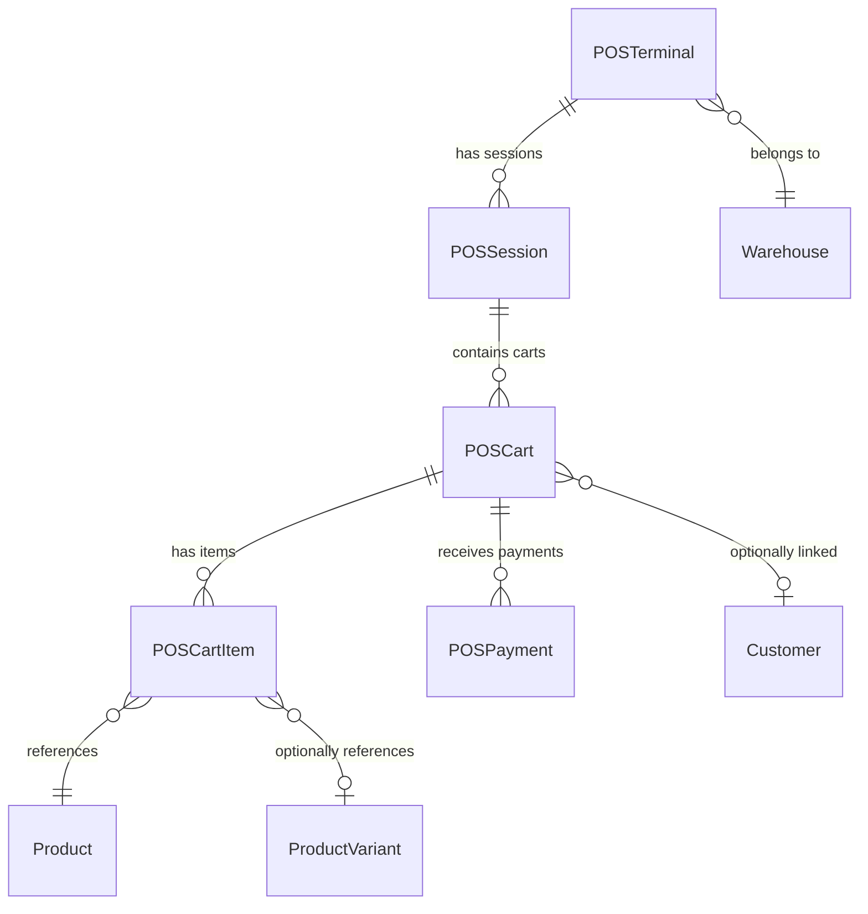
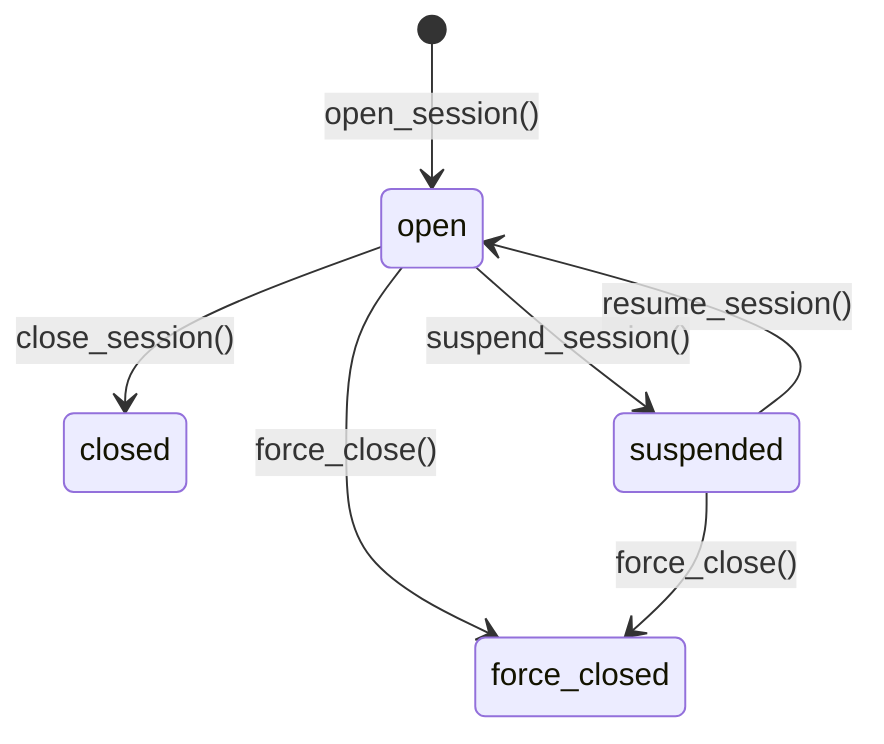
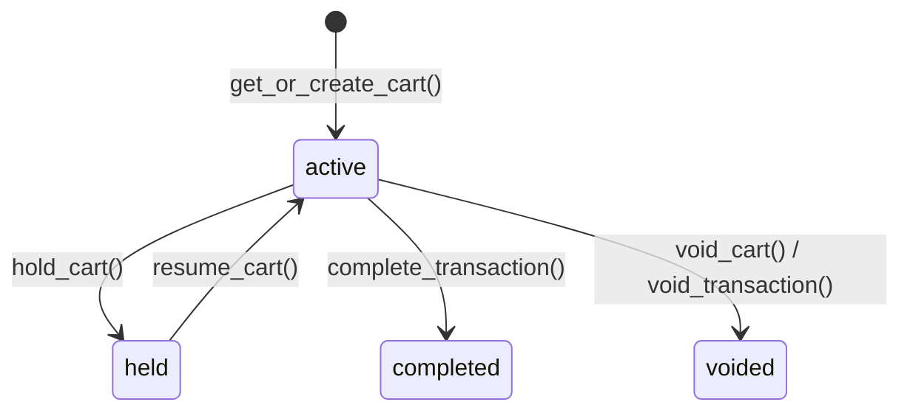
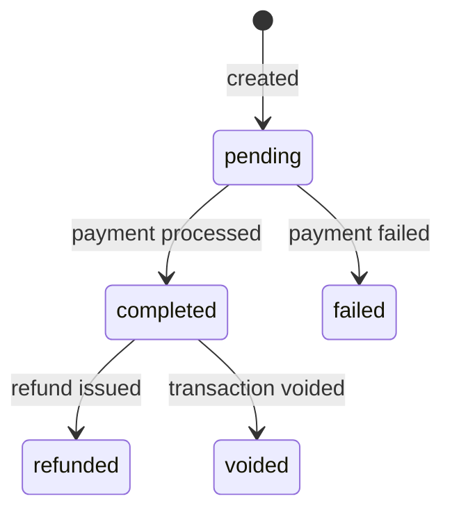

# POS Architecture

## Design Principles

1. **Stateless services** — `CartService` and `ProductSearchService` use
   `@staticmethod` / `@classmethod` with no instance state.
2. **Thin views, thick services** — views handle HTTP concerns; business
   logic lives in the service layer.
3. **Atomic transactions** — payment processing and transaction completion
   use `django.db.transaction.atomic()`.
4. **Multi-tenant isolation** — every query runs inside the tenant schema
   provided by `django-tenants`.
5. **Soft-delete everywhere** — all models inherit `SoftDeleteMixin`
   (`is_active`, `is_deleted`). `AliveManager` filters automatically.

## Layer Diagram

```
┌─────────────────────────────────────────────────────────────────┐
│                      Presentation Layer                         │
│  POSTerminalViewSet · POSSessionViewSet · POSCartViewSet        │
│  ProductSearchView · BarcodeScanView · PaymentProcessView       │
├─────────────────────────────────────────────────────────────────┤
│                        Service Layer                            │
│  CartService          — cart CRUD, discounts, hold/void         │
│  PaymentService       — cash/card/mobile, split, complete, void │
│  ProductSearchService — barcode, SKU, name, combined            │
├─────────────────────────────────────────────────────────────────┤
│                         Model Layer                             │
│  POSTerminal · POSSession · POSCart · POSCartItem               │
│  POSPayment · SearchHistory · QuickButtonGroup · QuickButton    │
└─────────────────────────────────────────────────────────────────┘
```

## Model Relationships



## State Machines

### Session Lifecycle



### Cart Lifecycle



### Payment Status



## Design Patterns Used

| Pattern            | Where                                                     | Purpose                                    |
| ------------------ | --------------------------------------------------------- | ------------------------------------------ |
| Service Layer      | `CartService`, `PaymentService`, `ProductSearchService`   | Encapsulate business logic away from views |
| Strategy           | Payment processing (`process_cash`, `process_card`, etc.) | Polymorphic payment handling               |
| Template Method    | `PaymentService.complete_transaction()`                   | Standardised completion flow               |
| Repository         | `AliveManager` / custom managers                          | Encapsulated query logic                   |
| Observer (signals) | Session open/close                                        | Side-effects like audit logging            |

## Key Decisions

- **No ORM-level cascade deletes for payments** — payments use `models.PROTECT`
  on the cart FK to prevent accidental data loss.
- **F-expressions for session counters** — `transaction_count` and
  `total_sales` are updated with `F()` to avoid race conditions.
- **Cart totals recalculated on every mutation** — ensures consistency
  without relying on eventual recalculation.
- **Weight-embedded barcodes** — parsed via prefix detection in
  `product_search_service.py` for items sold by weight.
