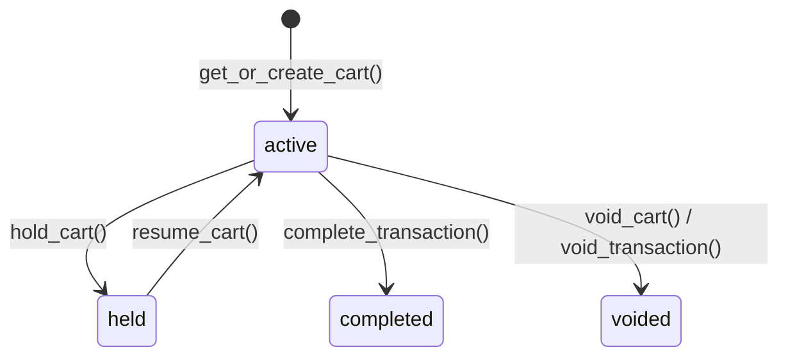

# POS Cart & Items

## POSCart Model

Represents a shopping cart / transaction in progress.

### Fields

| Field                  | Type                             | Description                                           |
| ---------------------- | -------------------------------- | ----------------------------------------------------- |
| `session`              | `FK → POSSession (CASCADE)`      | Owning session                                        |
| `customer`             | `FK → Customer (SET_NULL, null)` | Optional linked customer                              |
| `status`               | `CharField`                      | `active`, `held`, `completed`, `voided`, `abandoned`  |
| `reference_number`     | `CharField(unique)`              | Auto-generated transaction reference                  |
| `subtotal`             | `Decimal(12,2)`                  | Sum of line totals before cart discount               |
| `discount_total`       | `Decimal(12,2)`                  | Total line + cart discounts                           |
| `tax_total`            | `Decimal(12,2)`                  | Total tax                                             |
| `grand_total`          | `Decimal(12,2)`                  | Final amount: `subtotal − discount_total + tax_total` |
| `cart_discount_type`   | `CharField`                      | `percent`, `fixed`, `none`                            |
| `cart_discount_value`  | `Decimal`                        | Discount parameter                                    |
| `cart_discount_amount` | `Decimal(12,2)`                  | Computed cart-level discount amount                   |
| `cart_discount_reason` | `CharField`                      | Reason for discount                                   |
| `coupon_code`          | `CharField(null)`                | Applied coupon                                        |
| `notes`                | `TextField`                      | Free-form notes                                       |
| `completed_at`         | `DateTimeField(null)`            | When transaction was completed                        |

### Cart Lifecycle



### `is_modifiable` Property

Returns `True` only when `status == active`. Prevents modifications
to held, completed, or voided carts.

---

## POSCartItem Model

A single line in the cart.

### Fields

| Field             | Type                                  | Description                        |
| ----------------- | ------------------------------------- | ---------------------------------- |
| `cart`            | `FK → POSCart (CASCADE)`              | Parent cart                        |
| `product`         | `FK → Product (PROTECT)`              | Product reference                  |
| `variant`         | `FK → ProductVariant (PROTECT, null)` | Optional variant                   |
| `line_number`     | `IntegerField`                        | Display order                      |
| `quantity`        | `Decimal(10,3)`                       | Supports fractional (weight) items |
| `original_price`  | `Decimal(12,2)`                       | Price before discount              |
| `unit_price`      | `Decimal(12,2)`                       | Price after line discount          |
| `line_total`      | `Decimal(12,2)`                       | `unit_price × quantity`            |
| `discount_type`   | `CharField`                           | `percent`, `fixed`, `none`         |
| `discount_value`  | `Decimal`                             | Discount parameter                 |
| `discount_amount` | `Decimal(12,2)`                       | Computed discount for this line    |
| `is_taxable`      | `BooleanField`                        | Tax applicability                  |
| `tax_rate`        | `Decimal`                             | Tax percentage                     |
| `tax_amount`      | `Decimal(12,2)`                       | Computed tax for this line         |

### Key Methods

| Method                        | Description                                                                     |
| ----------------------------- | ------------------------------------------------------------------------------- |
| `set_prices_from_product()`   | Pulls `selling_price` (or variant price) into `original_price` and `unit_price` |
| `set_tax_from_product()`      | Sets `is_taxable`, `tax_rate` from the product's `tax_class`                    |
| `calculate_line_total()`      | Computes `unit_price × quantity`, applies discount, computes tax                |
| `apply_discount(type, value)` | Applies line-level discount and recalculates                                    |

---

## CartService

Stateless service with `@staticmethod` methods.

### Methods

| Method                | Signature                                                              | Description                                                                         |
| --------------------- | ---------------------------------------------------------------------- | ----------------------------------------------------------------------------------- |
| `get_or_create_cart`  | `(session, customer=None)` → `POSCart`                                 | Returns the active cart for the session or creates one                              |
| `add_to_cart`         | `(cart, product, quantity=1, variant=None)` → `POSCartItem`            | Adds/increments an item. If the product+variant already exists, increments quantity |
| `update_quantity`     | `(cart_item, quantity)`                                                | Sets new quantity; deletes if quantity ≤ 0                                          |
| `remove_from_cart`    | `(cart_item)`                                                          | Soft-deletes the item and recalculates                                              |
| `apply_line_discount` | `(cart_item, discount_type, discount_value, reason=None)`              | Applies discount to a single line                                                   |
| `apply_cart_discount` | `(cart, discount_type, discount_value, reason=None, coupon_code=None)` | Applies cart-wide discount                                                          |
| `hold_cart`           | `(cart)`                                                               | Sets status to `held`                                                               |
| `resume_cart`         | `(cart)`                                                               | Sets status back to `active`                                                        |
| `void_cart`           | `(cart, reason=None)`                                                  | Sets status to `voided`                                                             |
| `validate_cart`       | `(cart)`                                                               | Checks cart has items and valid totals                                              |
| `calculate_totals`    | `(cart)`                                                               | Recalculates `subtotal`, `discount_total`, `tax_total`, `grand_total`               |

### Totals Calculation

```
subtotal       = Σ (item.line_total)            for all active items
discount_total = Σ (item.discount_amount) + cart_discount_amount
tax_total      = Σ (item.tax_amount)
grand_total    = subtotal − cart_discount_amount + tax_total
```

### Adding Duplicate Products

When `add_to_cart()` finds an existing item with the same product+variant,
it increments the quantity rather than creating a duplicate line. The
`MAX_CART_ITEM_QUANTITY` constant caps the maximum quantity per line.
