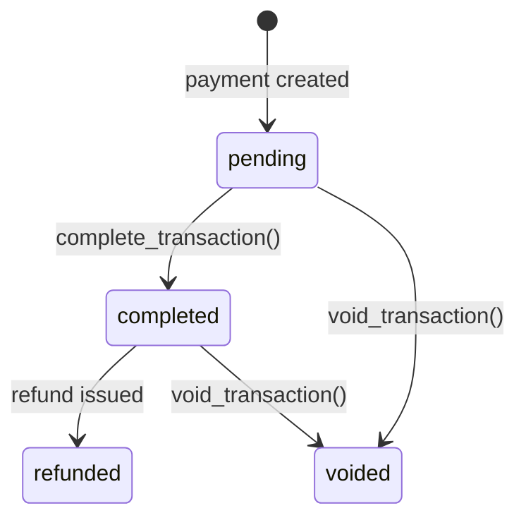

# POS Payment Processing

## Overview

`PaymentService` is an **instance-based** service: it is initialised with a
cart and the processing user, then exposes methods for every supported
payment method plus transaction completion and voiding.

```python
svc = PaymentService(cart=cart, user=request.user)
```

## Supported Payment Methods

| Method         | Constant                       | Service Method                                                            |
| -------------- | ------------------------------ | ------------------------------------------------------------------------- |
| Cash           | `PAYMENT_METHOD_CASH`          | `process_cash_payment(amount_tendered)`                                   |
| Card           | `PAYMENT_METHOD_CARD`          | `process_card_payment(amount, authorization_code, reference_number=None)` |
| Bank Transfer  | `PAYMENT_METHOD_BANK_TRANSFER` | `process_mobile_payment(amount, reference_number, method)`                |
| Mobile — FriMi | `PAYMENT_METHOD_MOBILE_FRIMI`  | `process_mobile_payment(...)`                                             |
| Mobile — Genie | `PAYMENT_METHOD_MOBILE_GENIE`  | `process_mobile_payment(...)`                                             |
| Store Credit   | `PAYMENT_METHOD_STORE_CREDIT`  | `process_store_credit(amount)`                                            |

## Cash Payment

```python
payment = svc.process_cash_payment(amount_tendered=Decimal("1000.00"))
```

- Calculates `remaining = grand_total − sum(completed payments)`.
- `payment.amount = remaining` (actual amount applied).
- `payment.change_due = amount_tendered − remaining`.
- If `amount_tendered < remaining`, the payment covers whatever was
  tendered and remains partially-paid.

## Card Payment

```python
payment = svc.process_card_payment(
    amount=Decimal("500.00"),
    authorization_code="AUTH-123",
    reference_number="REF-456",
)
```

- `amount` cannot exceed `remaining_amount`.
- `authorization_code` is mandatory.

## Mobile Payment

```python
payment = svc.process_mobile_payment(
    amount=Decimal("200.00"),
    reference_number="MOB-789",
    method="mobile_frimi",
)
```

## Store Credit

```python
payment = svc.process_store_credit(amount=Decimal("100.00"))
```

- Requires `cart.customer` to be set (raises `ValidationError` otherwise).

## Split Payment

```python
payments = svc.split_payment([
    {"method": "cash", "amount": Decimal("300"), "amount_tendered": Decimal("300")},
    {"method": "card", "amount": Decimal("200"), "authorization_code": "AUTH"},
])
```

Dispatches each entry to the appropriate `process_*` method. Minimum 2
entries required.

## Remaining Amount

```python
remaining = svc.get_remaining_amount()
# max(grand_total − sum(completed payments), 0)
```

## Can Complete

```python
if svc.can_complete_cart():
    result = svc.complete_transaction()
```

Returns `True` when `remaining_amount == 0`.

## Complete Transaction

```python
result = svc.complete_transaction()
# result = {"cart": cart, "receipt_data": {...}}
```

1. Marks all pending payments as **completed**.
2. Sets `cart.status = COMPLETED`, `cart.completed_at = now()`.
3. Updates session counters via `F()` expressions:
   - `transaction_count += 1`
   - `total_sales += cart.grand_total`
4. Returns receipt data dict.

## Void Transaction

```python
svc.void_transaction(reason="Customer changed mind")
```

1. Marks all pending/completed payments as **voided**.
2. Sets `cart.status = VOIDED`.
3. Does **not** decrement session counters (the transaction was never completed).

## Payment Status Transitions



## Receipt Data

`generate_receipt_data()` returns:

```json
{
  "terminal": { "code": "POS-001", "name": "Main Register" },
  "session": { "session_number": "SESS-POS001-20250101-0001" },
  "cart": { "reference_number": "...", "subtotal": "...", "grand_total": "..." },
  "items": [{ "name": "...", "qty": "...", "line_total": "..." }],
  "payments": [{ "method": "cash", "amount": "...", "change_due": "..." }],
  "totals": { "subtotal": "...", "discount": "...", "tax": "...", "grand_total": "..." }
}
```
