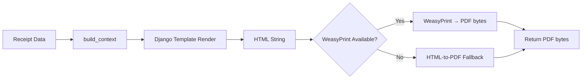

# Digital Receipts

> Back to [Receipt Module](index.md) · See also [API Reference](api.md)

## PDF Generation

`PDFGeneratorService` renders receipt data to PDF using Django templates and WeasyPrint.

### Layouts

| Template             | Use Case                        | Paper |
| -------------------- | ------------------------------- | ----- |
| `base_receipt.html`  | Standard 80mm thermal-style PDF | 80mm  |
| `thermal_style.html` | Narrow 58mm thermal-style PDF   | 58mm  |
| `a4_invoice.html`    | Full A4 tax invoice             | A4    |

### How It Works



### Usage

```python
from apps.pos.receipts.services import PDFGeneratorService

service = PDFGeneratorService()

# HTML preview
html = service.generate_html(receipt_data, template_name="base_receipt.html")

# PDF bytes
pdf_bytes = service.generate_pdf(receipt_data)

# Metadata
meta = service.get_metadata(receipt_data)
# {"receipt_number": "REC-20250101-00001", "generated_at": ...}
```

### Tenant Branding

The PDF templates use data from the `ReceiptTemplate` header fields:

- `header_business_name` — prominent at top
- `header_logo_url` — logo image
- `header_address_line1`, `header_city`, etc. — address block
- `header_tax_id` — tax registration number
- `currency_symbol` — used for all monetary values

---

## Email Delivery

`ReceiptEmailService` sends the receipt via Django's `EmailMultiAlternatives`.

### Flow

```mermaid
flowchart TD
    A[POST /receipts/{id}/email/] --> B[Validate email address]
    B --> C[Build email context]
    C --> D[Render HTML + plain text templates]
    D --> E{Attach PDF?}
    E -->|Yes| F[Generate PDF → attach]
    E -->|No| G[Skip attachment]
    F --> H[Send via SMTP]
    G --> H
    H --> I[Mark receipt as emailed]
```

### Configuration

Emails use Django's built-in SMTP backend. Required settings:

```python
EMAIL_BACKEND = "django.core.mail.backends.smtp.EmailBackend"
EMAIL_HOST = "smtp.example.com"
EMAIL_PORT = 587
EMAIL_USE_TLS = True
EMAIL_HOST_USER = "receipts@example.com"
EMAIL_HOST_PASSWORD = "..."
DEFAULT_FROM_EMAIL = "receipts@example.com"
```

### Custom Templates

Two templates are provided:

| Template             | Format     | Path                                |
| -------------------- | ---------- | ----------------------------------- |
| `receipt_email.html` | HTML       | `receipts/email/receipt_email.html` |
| `receipt_email.txt`  | Plain text | `receipts/email/receipt_email.txt`  |

Override by placing custom versions in your project's template directories.

### API Example

```bash
curl -X POST /api/v1/pos/receipts/{id}/email/ \
  -H "Authorization: Bearer <token>" \
  -H "Content-Type: application/json" \
  -d '{
    "email": "customer@example.com",
    "subject": "Your Receipt from My Store",
    "message": "Thank you for your purchase!",
    "attach_pdf": true,
    "cc": ["manager@example.com"]
  }'
```

---

## Receipt Verification

`ReceiptVerificationService` generates HMAC-SHA256 hashes to prove receipt authenticity.

### How It Works

1. A hash is computed from the receipt data using `SECRET_KEY`.
2. A short verification token (16 characters) is derived from the hash.
3. The token can be embedded in QR codes or printed as text.
4. Verification checks the token against recomputed hash.

```python
from apps.pos.receipts.services import ReceiptVerificationService

service = ReceiptVerificationService()

# Generate
hash_value = service.generate_hash(receipt_data)
token = service.generate_token(receipt_data)  # 16-char string
url = service.generate_verification_url(receipt_data)

# Verify
is_valid = service.verify_token(receipt_data, token)  # True / False
```

### QR Code Integration

Set `show_qr_code = True` on the template and configure:

```python
template.qr_code_data_template = "https://verify.example.com/{receipt_number}"
template.qr_code_size = 30  # mm
```

The QR code is embedded in both thermal prints and PDFs.

---

## SMS Delivery (Stub)

`ReceiptSMSService` provides the interface for SMS receipt delivery. The current implementation is a stub that returns a success dict without sending.

```python
from apps.pos.receipts.services import ReceiptSMSService

service = ReceiptSMSService()
result = service.send_sms(phone_number="+94771234567", receipt_data=data)
# {"status": "sent", "phone": "+94771234567"}
```

To integrate a real provider (Twilio, Dialog, etc.), subclass `ReceiptSMSService` and override `send_sms`.
