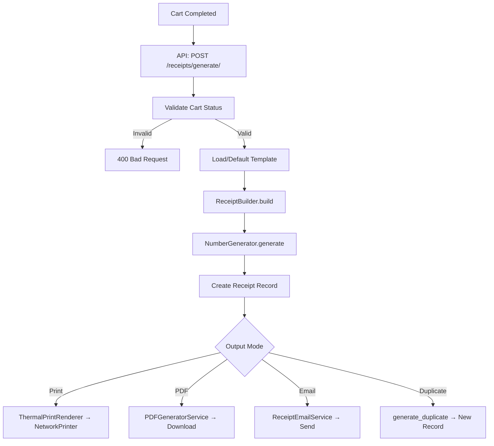

# Receipt Module

> **Module:** `apps.pos.receipts`
> **Phase:** SP03 — Receipt Generation & Printing

## Key Features

- **Receipt Generation** — Build structured receipt data from completed POS carts
- **Thermal Printing** — ESC/POS-based printing for 80mm and 58mm paper
- **PDF Generation** — A4 invoice and thermal-style PDF layouts via WeasyPrint
- **Email Delivery** — HTML + plain text email with optional PDF attachment
- **Template System** — Configurable templates with inheritance support
- **Verification** — HMAC-SHA256 hashes for receipt authenticity
- **Duplicate Handling** — Controlled reprint with watermark tracking
- **SMS Stub** — Pluggable SMS delivery (stub for future provider)

## Architecture Overview

```
┌─────────────────────────────────────────────────────┐
│                    API Layer                          │
│  ReceiptViewSet · TemplateViewSet · ExportView       │
├─────────────────────────────────────────────────────┤
│                  Service Layer                        │
│  ReceiptBuilder ─── NumberGenerator                  │
│  ThermalPrintRenderer ─── PDFGeneratorService        │
│  ReceiptEmailService ─── ReceiptVerificationService  │
│  PrintQueue ─── NetworkPrinter ─── USBPrinterStub    │
│  ReceiptSMSService                                   │
├─────────────────────────────────────────────────────┤
│                  Model Layer                          │
│  Receipt · ReceiptTemplate · ReceiptSequence         │
├─────────────────────────────────────────────────────┤
│                  Templates                            │
│  base_receipt.html · a4_invoice.html                 │
│  thermal_style.html · receipt_email.html/txt         │
└─────────────────────────────────────────────────────┘
```

## Receipt Generation Flow



## Quick Links

| Topic     | Document                     | Description                                       |
| --------- | ---------------------------- | ------------------------------------------------- |
| Templates | [templates.md](templates.md) | Template model, inheritance, customisation        |
| Printing  | [printing.md](printing.md)   | Thermal printer setup, ESC/POS, troubleshooting   |
| Digital   | [digital.md](digital.md)     | PDF generation, email, verification, SMS          |
| API       | [api.md](api.md)             | Endpoint reference with request/response examples |

## Module Location

```
apps/pos/receipts/
├── __init__.py
├── admin.py
├── constants.py
├── urls.py
├── models/
│   ├── receipt.py
│   ├── receipt_template.py
│   └── receipt_sequence.py
├── services/
│   ├── builder.py
│   ├── number_generator.py
│   ├── exceptions.py
│   ├── escpos_constants.py
│   ├── thermal_printer.py
│   ├── thermal_renderer.py
│   ├── print_connectivity.py
│   ├── print_queue.py
│   ├── pdf_generator.py
│   ├── email_service.py
│   ├── verification.py
│   └── sms_service.py
├── serializers/
│   ├── receipt.py
│   └── template.py
├── views/
│   ├── receipt.py
│   └── template.py
└── templates/receipts/
    ├── pdf/
    └── email/
```

## Quick Start

```python
from apps.pos.receipts.services import (
    ReceiptBuilder,
    ReceiptNumberGenerator,
)
from apps.pos.receipts.models import Receipt, ReceiptTemplate

# 1. Get a completed cart
cart = POSCart.objects.get(pk=cart_id, status="completed")

# 2. Load a template (or use default)
template = ReceiptTemplate.objects.get_default()

# 3. Build receipt data
builder = ReceiptBuilder(template=template)
receipt_data = builder.build(cart)

# 4. Generate a unique receipt number
generator = ReceiptNumberGenerator()
receipt_number = generator.generate()

# 5. Create the receipt record
receipt = Receipt.objects.create(
    receipt_number=receipt_number,
    cart=cart,
    receipt_type="SALE",
    template=template,
    receipt_data=receipt_data,
    generated_by=request.user,
)
```

## Prerequisites

- Django 5+, DRF, django-tenants
- **WeasyPrint** — optional, required for PDF generation
- Network-accessible thermal printer for direct printing
- SMTP configuration for email delivery
