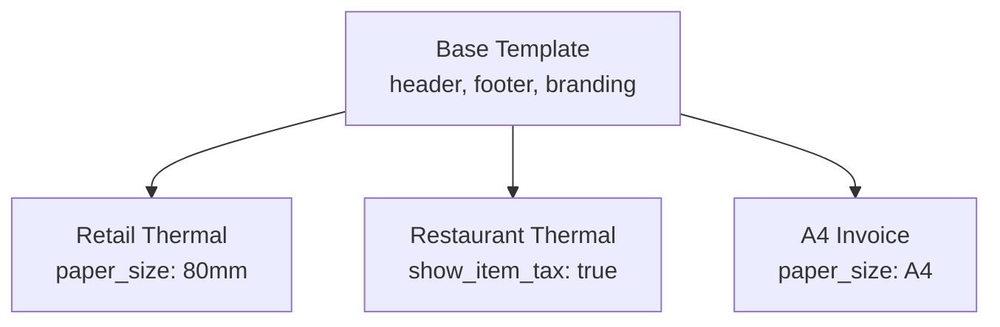

# Receipt Templates

> Back to [Receipt Module](index.md) · See also [API Reference](api.md)

## ReceiptTemplate Model

`ReceiptTemplate` stores all layout and branding settings for receipt output.

### Core Fields

| Field         | Type           | Description             |
| ------------- | -------------- | ----------------------- |
| `name`        | CharField(100) | Unique template name    |
| `description` | TextField      | Optional description    |
| `paper_size`  | CharField      | `80mm`, `58mm`, or `A4` |
| `is_default`  | BooleanField   | One default per tenant  |
| `is_system`   | BooleanField   | Protected from deletion |

### Header Fields

| Field                                                                 | Type                 | Description                   |
| --------------------------------------------------------------------- | -------------------- | ----------------------------- |
| `header_business_name`                                                | CharField(200)       | Business name at top          |
| `header_address_line1` / `line2`                                      | CharField            | Address lines                 |
| `header_city`, `header_state`, `header_postal_code`, `header_country` | CharField            | Location                      |
| `header_phone`, `header_email`, `header_website`                      | CharField            | Contact info                  |
| `header_tax_id`                                                       | CharField            | Tax / VAT registration number |
| `header_logo_url`                                                     | URLField             | Logo image URL                |
| `header_logo_width` / `height`                                        | PositiveIntegerField | Logo dimensions (px)          |
| `header_extra_line1` / `line2`                                        | CharField            | Additional custom lines       |

### Section Toggles

| Field                    | Default | Description       |
| ------------------------ | ------- | ----------------- |
| `show_item_sku`          | False   | Show SKU column   |
| `show_item_tax`          | False   | Per-item tax      |
| `show_item_discount`     | False   | Per-item discount |
| `show_subtotal`          | True    | Subtotal line     |
| `show_tax_total`         | True    | Tax total         |
| `show_discount_total`    | True    | Discount total    |
| `show_payment_method`    | True    | Payment method    |
| `show_payment_reference` | False   | Payment reference |
| `show_change_due`        | True    | Change returned   |
| `show_qr_code`           | False   | QR code block     |
| `show_barcode`           | False   | Barcode block     |

### Footer & QR Fields

| Field                           | Description                    |
| ------------------------------- | ------------------------------ |
| `footer_line1` … `footer_line4` | Up to 4 custom footer lines    |
| `footer_thank_you_message`      | "Thank you" text               |
| `qr_code_data_template`         | Template string for QR content |
| `qr_code_size`                  | Size in mm (default 30)        |
| `barcode_type`                  | `CODE128`, `EAN13`, `QR`       |

### Font & Styling

| Field                     | Default      | Description        |
| ------------------------- | ------------ | ------------------ |
| `font_size_header`        | 12           | Header text size   |
| `font_size_body`          | 10           | Body text size     |
| `font_size_footer`        | 8            | Footer text size   |
| `currency_symbol`         | `$`          | Displayed symbol   |
| `currency_decimal_places` | 2            | Decimal precision  |
| `date_format`             | `YYYY-MM-DD` | Date format string |
| `time_format`             | `HH:mm:ss`   | Time format string |

---

## Template Inheritance

Templates support a parent-child hierarchy. A child template inherits all fields from its parent and can selectively override individual values.



### How It Works

1. Set `parent_template` on a child template.
2. Call `child.get_effective_value(field_name)` — returns the child's value if set, otherwise walks up the chain.
3. The chain is unbounded but typically 1-2 levels deep.

```python
# Child inherits header_business_name from parent
child = ReceiptTemplate.objects.create(
    name="Small Store",
    parent_template=base_template,
    paper_size="58mm",  # override
)
# Reads parent's header_business_name if child's is empty
name = child.get_effective_value("header_business_name")
```

### Cloning Templates

```python
cloned = template.clone_template(new_name="Copy of Standard")
# cloned is a new template with all fields copied, is_default=False
```

---

## Default Template

- Only one template per tenant may be default (`is_default=True`).
- Setting a new default automatically un-defaults the previous one.
- `ReceiptTemplate.objects.get_default()` returns the current default or raises `DoesNotExist`.
- If no template is specified during receipt generation, the default is used.

---

## Configuration Examples

### Standard 80mm Retail

```python
ReceiptTemplate.objects.create(
    name="Standard 80mm",
    paper_size="80mm",
    is_default=True,
    header_business_name="My Store",
    header_address_line1="123 Main St",
    header_phone="+94 11 234 5678",
    header_tax_id="LK123456789",
    show_item_sku=False,
    show_qr_code=True,
    qr_code_data_template="https://verify.example.com/{receipt_number}",
    footer_line1="Thank you for shopping!",
    footer_line2="Returns within 14 days with receipt",
    currency_symbol="Rs.",
    currency_decimal_places=2,
)
```

### A4 Invoice

```python
ReceiptTemplate.objects.create(
    name="A4 Tax Invoice",
    paper_size="A4",
    header_business_name="My Store Pvt Ltd",
    header_tax_id="LK123456789",
    show_item_tax=True,
    show_item_sku=True,
    show_barcode=True,
    barcode_type="CODE128",
)
```

---

## Admin Interface

The Django admin provides a `ReceiptTemplateAdmin` with:

- List display: name, paper_size, is_default, is_system, created_on
- List filters: paper_size, is_default, is_system
- Search: name, description
- Fieldsets grouped by section (header, items, totals, payments, footer, QR, font)
