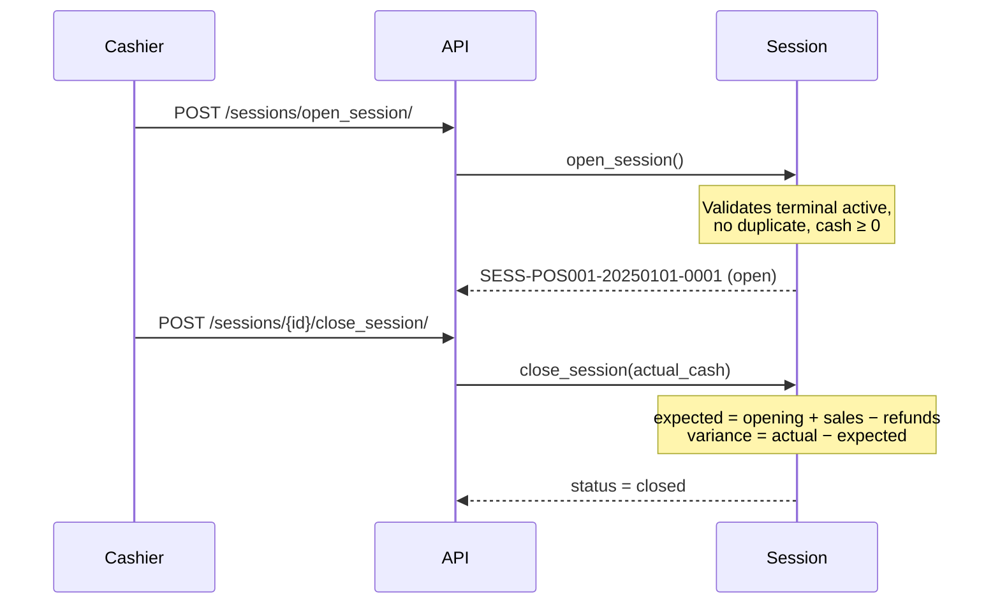

# POS Terminals & Sessions

## POSTerminal Model

Represents a physical or virtual point-of-sale register.

### Fields

| Field                                                    | Type                     | Description                                    |
| -------------------------------------------------------- | ------------------------ | ---------------------------------------------- |
| `code`                                                   | `CharField(unique)`      | Terminal identifier, e.g. `POS-001`            |
| `name`                                                   | `CharField`              | Human-friendly name                            |
| `warehouse`                                              | `FK → Warehouse`         | Stock location for this terminal               |
| `status`                                                 | `CharField`              | `active`, `inactive`, `maintenance`, `offline` |
| `location` / `floor` / `section`                         | `CharField`              | Physical placement                             |
| `is_mobile`                                              | `BooleanField`           | Mobile terminal flag                           |
| `ip_address`                                             | `GenericIPAddressField`  | Network address                                |
| `printer_type` / `receipt_printer_ip`                    | `CharField`              | Receipt printer config                         |
| `cash_drawer_enabled`                                    | `BooleanField`           | Cash drawer toggle                             |
| `barcode_scanner_enabled`                                | `BooleanField`           | Scanner toggle                                 |
| `default_tax`                                            | `FK → TaxClass`          | Default tax applied                            |
| `allow_price_override`                                   | `BooleanField`           | Override selling price                         |
| `allow_discount` / `max_discount_percent`                | `BooleanField / Decimal` | Discount guard                                 |
| `require_customer`                                       | `BooleanField`           | Require customer on every sale                 |
| `allow_negative_inventory`                               | `BooleanField`           | Sell even if stock ≤ 0                         |
| `auto_print_receipt` / `receipt_copies`                  | `BooleanField / Integer` | Auto-print settings                            |
| `offline_mode_enabled`                                   | `BooleanField`           | Work offline                                   |
| `receipt_header` / `receipt_footer` / `receipt_language` | `TextField / CharField`  | Receipt template                               |

### Custom Manager — `POSTerminalManager`

```python
POSTerminal.objects.active()              # status = 'active', is_active = True
POSTerminal.objects.by_warehouse(wh)      # filter by warehouse
```

### Status Transitions

| From          | Allowed To                |
| ------------- | ------------------------- |
| `active`      | `inactive`, `maintenance` |
| `inactive`    | `active`                  |
| `maintenance` | `active`, `inactive`      |

> A terminal **cannot** change away from `active` while it has an open session.

---

## POSSession Model

Represents a cashier shift or work period on a terminal.

### Fields

| Field                 | Type                          | Description                                   |
| --------------------- | ----------------------------- | --------------------------------------------- |
| `terminal`            | `FK → POSTerminal`            | Which terminal                                |
| `user`                | `FK → PlatformUser`           | Cashier/operator                              |
| `session_number`      | `CharField(unique)`           | Format: `SESS-{code}-{YYYYMMDD}-{seq}`        |
| `status`              | `CharField`                   | `open`, `closed`, `suspended`, `force_closed` |
| `opened_at`           | `DateTimeField(auto_now_add)` | When opened                                   |
| `closed_at`           | `DateTimeField(null)`         | When closed                                   |
| `opening_cash_amount` | `Decimal(15,2)`               | Cash in drawer at start                       |
| `expected_cash`       | `Decimal(15,2)`               | Calculated: `opening + sales − refunds`       |
| `actual_cash_amount`  | `Decimal(15,2)`               | Counted cash at close                         |
| `cash_variance`       | `Decimal(15,2)`               | `actual − expected`                           |
| `total_sales`         | `Decimal(15,2)`               | Running total of completed sales              |
| `total_refunds`       | `Decimal(15,2)`               | Running total of refunds                      |
| `transaction_count`   | `IntegerField`                | Number of completed transactions              |

### Session Lifecycle



### Key Rules

1. Only **one open session** per terminal at a time.
2. Terminal must be **active** to open a session.
3. `opening_cash_amount` must be ≥ 0.
4. Session counters (`total_sales`, `transaction_count`) are updated via
   `F()` expressions inside `PaymentService.complete_transaction()`.

### Cash Reconciliation Formula

```
expected_cash = opening_cash_amount + total_sales − total_refunds
cash_variance = actual_cash_amount − expected_cash
```

A **negative** variance means cash is short; **positive** means overage.
