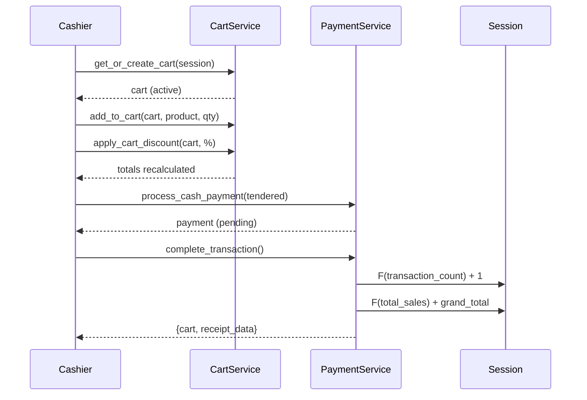

# POS Transaction Lifecycle

## Overview

A **transaction** is the complete flow from cart creation through payment
to completion. There is no separate `POSTransaction` model — the `POSCart`
model (status `completed`) plus its linked `POSPayment` records represent
the completed transaction.

## Full Flow



## Steps in Detail

### 1. Cart Creation

```python
cart = CartService.get_or_create_cart(session, customer=None)
```

- One active cart per session at a time.
- If an active cart already exists, it is returned.

### 2. Item Entry

```python
CartService.add_to_cart(cart, product, quantity=1, variant=None)
```

- Prices pulled from product / variant `selling_price`.
- Tax set from product's `tax_class`.
- Cart totals auto-recalculated after every item change.

### 3. Discounts (optional)

```python
# Line discount
CartService.apply_line_discount(item, "percent", Decimal("10"))

# Cart discount
CartService.apply_cart_discount(cart, "fixed", Decimal("50"), reason="Loyalty")
```

### 4. Payment

```python
svc = PaymentService(cart=cart, user=cashier)
svc.process_cash_payment(amount_tendered=cart.grand_total)
```

Multiple payments can be recorded (split payment) before completing.

### 5. Completion

```python
result = svc.complete_transaction()
```

Atomically:

- Marks pending payments as `completed`.
- Sets `cart.status = COMPLETED`, `cart.completed_at = now()`.
- Increments `session.transaction_count` by 1.
- Adds `cart.grand_total` to `session.total_sales`.

### 6. Receipt

`result["receipt_data"]` contains the full receipt dict with terminal,
session, item, payment, and totals information.

## Void Flow

```python
svc.void_transaction(reason="Customer cancelled")
```

- All payments moved to `voided` status.
- Cart status set to `voided`.
- Session counters are **not** modified (transaction was never completed).

## Held Cart Flow

```python
CartService.hold_cart(cart)          # status → held
# ... serve another customer ...
CartService.resume_cart(cart)        # status → active
# continue adding items or processing payment
```

Items and totals are preserved across hold/resume.

## Session Close & Reconciliation

After all transactions:

```python
session.close_session(actual_cash_amount=counted_cash)
```

Calculates:

```
expected_cash = opening_cash + total_sales − total_refunds
cash_variance = actual_cash − expected_cash
```

## Concurrency Considerations

- `F()` expressions prevent lost updates on session counters.
- `transaction.atomic()` wraps the payment + cart-status update.
- Only one active cart per session is enforced by `get_or_create_cart`.
